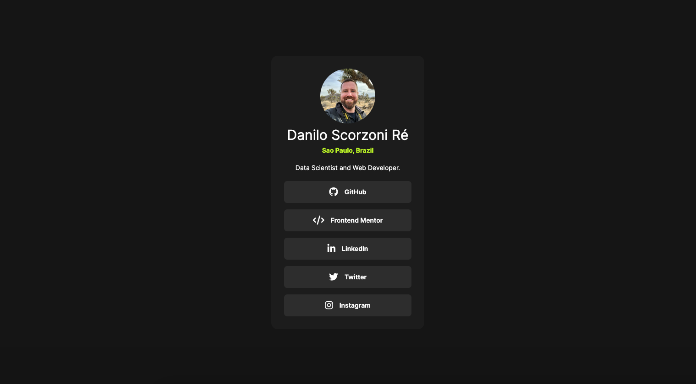
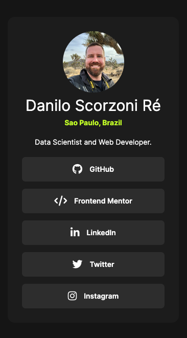

# Frontend Mentor - Social links profile solution

This is a solution to the [Social links profile challenge on Frontend Mentor](https://www.frontendmentor.io/challenges/social-links-profile-UG32l9m6dQ). Frontend Mentor challenges help you improve your coding skills by building realistic projects.

## Table of contents

-   [Overview](#overview)
    -   [The challenge](#the-challenge)
    -   [Screenshot](#screenshot)
    -   [Links](#links)
-   [My process](#my-process)
    -   [Built with](#built-with)
-   [Author](#author)

## Overview

### The challenge

Users should be able to:

-   See hover and focus states for all interactive elements on the page

### Screenshot

Desktop

Mobile

### Links

-   Solution URL: [Github](https://github.com/dscorzoni/project-social-media-links)
-   Live Site URL: [Github Pages](https://dscorzoni.github.io/project-social-media-links)

## My process

### Built with

-   Semantic HTML5 markup
-   CSS custom properties
-   Flexbox
-   Mobile-first workflow

### What I learned

This was a fun an quick exercise of HTML and CSS. I added a few things to the original proposal:

-   Social Media Icons using FontAwesome.
-   Animated Transitions for Hover effects.

## Author

-   Website - [Danilo Scorzoni Ré](https://dscorzoni.github.io/project-social-media-links)
-   Frontend Mentor - [@dscorzoni](https://www.frontendmentor.io/profile/dscorzoni)
-   LinkedIn - [@dscorzoni](https://www.linkedin.com/in/dscorzoni/)
